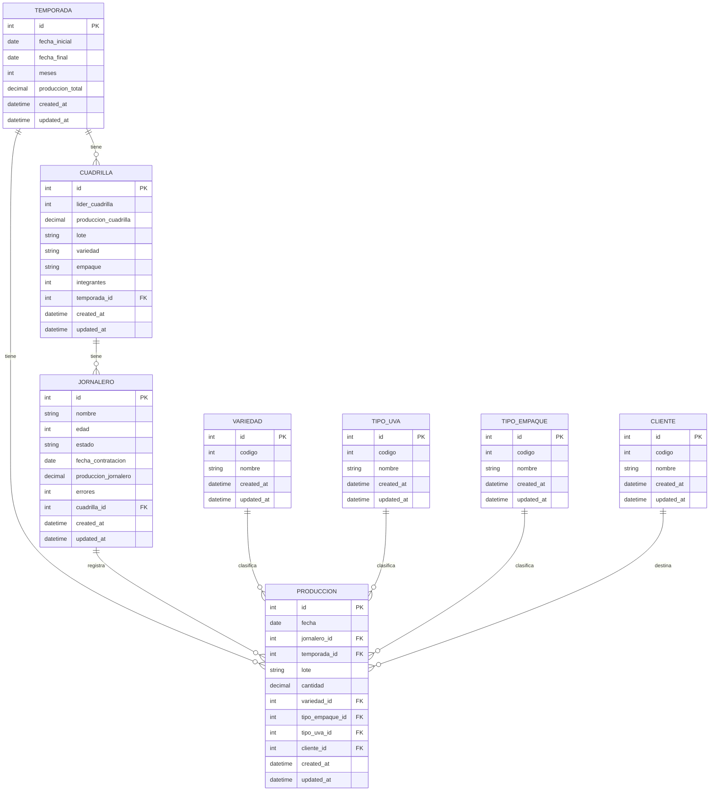

# Diagrama de Base de Datos NASE

## Descripción de Entidades

### TEMPORADA
Representa un período de trabajo agrícola con fechas de inicio y fin.

| Campo | Tipo | Descripción |
|-------|------|-------------|
| id | int | Identificador único (PK) |
| fecha_inicial | date | Fecha de inicio de la temporada |
| fecha_final | date | Fecha de finalización de la temporada (opcional) |
| meses | int | Duración en meses (opcional) |
| produccion_total | decimal(15,3) | Cantidad total producida en la temporada (opcional) |
| created_at | datetime | Fecha de creación del registro |
| updated_at | datetime | Fecha de última actualización |

### CUADRILLA
Grupo de trabajadores asignados a una temporada específica.

| Campo | Tipo | Descripción |
|-------|------|-------------|
| id | int | Identificador único (PK) |
| lider_cuadrilla | int | Identificador del líder de la cuadrilla (opcional) |
| produccion_cuadrilla | decimal(15,3) | Cantidad total producida por la cuadrilla (opcional) |
| lote | string | Identificador del lote asignado |
| variedad | string | Variedad de cultivo asignada |
| empaque | string | Tipo de empaque utilizado (opcional) |
| integrantes | int | Número de integrantes (opcional) |
| temporada_id | int | Referencia a la temporada (FK) |
| created_at | datetime | Fecha de creación del registro |
| updated_at | datetime | Fecha de última actualización |

### JORNALERO
Trabajador individual que puede pertenecer a una cuadrilla.

| Campo | Tipo | Descripción |
|-------|------|-------------|
| id | int | Identificador único (PK) |
| nombre | string | Nombre completo del jornalero |
| edad | int | Edad del jornalero |
| estado | string | Estado o situación actual del jornalero |
| fecha_contratacion | date | Fecha de contratación |
| produccion_jornalero | decimal(15,3) | Cantidad total producida por el jornalero (opcional) |
| errores | int | Conteo de errores registrados (opcional) |
| cuadrilla_id | int | Referencia a la cuadrilla (FK, opcional) |
| created_at | datetime | Fecha de creación del registro |
| updated_at | datetime | Fecha de última actualización |

### PRODUCCION
Registro de la producción diaria de cada jornalero, incluyendo cantidad, tipo de uva, empaque y cliente.

| Campo | Tipo | Descripción |
|-------|------|-------------|
| id | int | Identificador único (PK) |
| fecha | date | Fecha del registro de producción |
| jornalero_id | int | Referencia al jornalero (FK) |
| temporada_id | int | Referencia a la temporada (FK) |
| lote | string | Identificador del lote |
| cantidad | decimal(15,3) | Cantidad producida |
| variedad_id | int | Referencia a la variedad (FK, opcional) |
| tipo_empaque_id | int | Referencia al tipo de empaque (FK, opcional) |
| tipo_uva_id | int | Referencia al tipo de uva (FK, opcional) |
| cliente_id | int | Referencia al cliente (FK, opcional) |
| created_at | datetime | Fecha de creación del registro |
| updated_at | datetime | Fecha de última actualización |

### VARIEDAD
Catálogo de variedades de cultivos.

| Campo | Tipo | Descripción |
|-------|------|-------------|
| id | int | Identificador único (PK) |
| codigo | int | Código único de la variedad |
| nombre | string | Nombre de la variedad |
| created_at | datetime | Fecha de creación del registro |
| updated_at | datetime | Fecha de última actualización |

### TIPO_UVA
Catálogo de tipos de uva.

| Campo | Tipo | Descripción |
|-------|------|-------------|
| id | int | Identificador único (PK) |
| codigo | int | Código único del tipo de uva |
| nombre | string | Nombre del tipo de uva |
| created_at | datetime | Fecha de creación del registro |
| updated_at | datetime | Fecha de última actualización |

### TIPO_EMPAQUE
Catálogo de tipos de empaque para el producto.

| Campo | Tipo | Descripción |
|-------|------|-------------|
| id | int | Identificador único (PK) |
| codigo | int | Código único del tipo de empaque |
| nombre | string | Nombre del tipo de empaque |
| created_at | datetime | Fecha de creación del registro |
| updated_at | datetime | Fecha de última actualización |

### CLIENTE
Catálogo de clientes que reciben la producción.

| Campo | Tipo | Descripción |
|-------|------|-------------|
| id | int | Identificador único (PK) |
| codigo | int | Código único del cliente |
| nombre | string | Nombre del cliente |
| created_at | datetime | Fecha de creación del registro |
| updated_at | datetime | Fecha de última actualización |

## Relaciones

1. **TEMPORADA → CUADRILLA**:
   - Una temporada puede tener múltiples cuadrillas
   - Relación: One-to-Many
   - Restricción: On Delete Restrict, On Update Cascade

2. **TEMPORADA → PRODUCCION**:
   - Una temporada puede tener múltiples registros de producción
   - Relación: One-to-Many
   - Restricción: On Delete Restrict, On Update Cascade

3. **CUADRILLA → JORNALERO**:
   - Una cuadrilla puede tener múltiples jornaleros
   - Relación: One-to-Many
   - Restricción: On Delete SetNull, On Update Cascade

4. **JORNALERO → PRODUCCION**:
   - Un jornalero puede registrar múltiples producciones
   - Relación: One-to-Many
   - Restricción: On Delete Cascade, On Update Cascade

5. **VARIEDAD → PRODUCCION**:
   - Una variedad puede estar asociada a múltiples producciones
   - Relación: One-to-Many
   - Columna opcional en PRODUCCION

6. **TIPO_UVA → PRODUCCION**:
   - Un tipo de uva puede estar asociado a múltiples producciones
   - Relación: One-to-Many
   - Columna opcional en PRODUCCION

7. **TIPO_EMPAQUE → PRODUCCION**:
   - Un tipo de empaque puede estar asociado a múltiples producciones
   - Relación: One-to-Many
   - Columna opcional en PRODUCCION

8. **CLIENTE → PRODUCCION**:
   - Un cliente puede estar asociado a múltiples producciones
   - Relación: One-to-Many
   - Columna opcional en PRODUCCION

## Índices

La tabla PRODUCCION tiene los siguientes índices para optimizar consultas:

1. `idx_produccion_jornalero` - Índice en jornalero_id
2. `idx_produccion_temporada` - Índice en temporada_id
3. `idx_produccion_fecha` - Índice en fecha
4. `idx_produccion_jornalero_temporada` - Índice compuesto en (jornalero_id, temporada_id)
5. `idx_produccion_variedad` - Índice en variedad_id
6. `idx_produccion_tipo_empaque` - Índice en tipo_empaque_id
7. `idx_produccion_tipo_uva` - Índice en tipo_uva_id
8. `idx_produccion_cliente` - Índice en cliente_id 