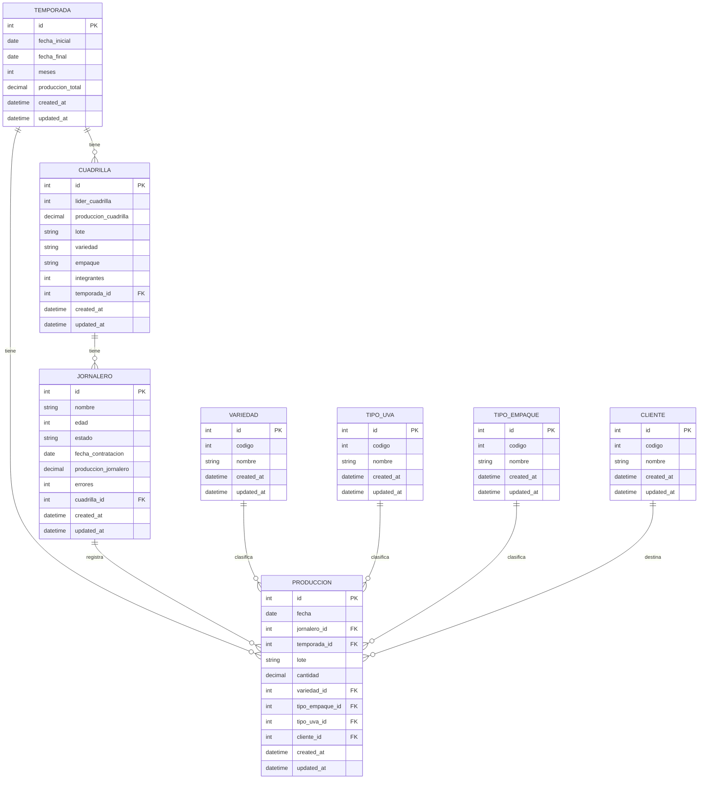

# Diagrama de Base de Datos NASE

## Descripción de Entidades

### TEMPORADA
Representa un período de trabajo agrícola con fechas de inicio y fin.

### CUADRILLA
Grupo de trabajadores asignados a una temporada específica.

### JORNALERO
Trabajador individual que puede pertenecer a una cuadrilla.

### PRODUCCION
Registro de la producción diaria de cada jornalero, incluyendo cantidad, tipo de uva, empaque y cliente.

### VARIEDAD
Catálogo de variedades de cultivos.

### TIPO_UVA
Catálogo de tipos de uva.

### TIPO_EMPAQUE
Catálogo de tipos de empaque para el producto.

### CLIENTE
Catálogo de clientes que reciben la producción.

## Relaciones

- Una **TEMPORADA** puede tener múltiples **CUADRILLAS** y **PRODUCCIONES**.
- Una **CUADRILLA** puede tener múltiples **JORNALEROS**.
- Un **JORNALERO** puede registrar múltiples **PRODUCCIONES**.
- Una **PRODUCCION** está asociada con una **VARIEDAD**, un **TIPO_UVA**, un **TIPO_EMPAQUE** y un **CLIENTE**. 