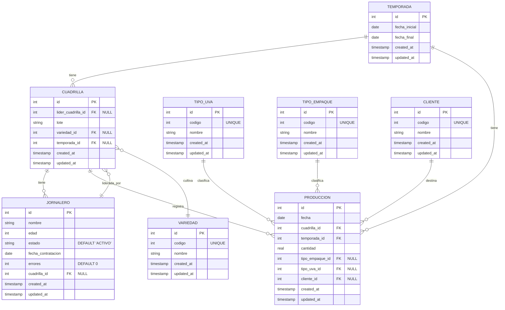

# Diagrama de Base de Datos NASE

## Descripción de Entidades

### TEMPORADA
Representa un período de trabajo agrícola con fechas de inicio y fin.

### CUADRILLA
Grupo de trabajadores asignados a una temporada específica y una variedad de cultivo. Puede tener un líder que debe ser un jornalero.

### JORNALERO
Trabajador individual que puede pertenecer a una cuadrilla y puede ser líder de una cuadrilla.

### PRODUCCION
Registro de la producción diaria de cada cuadrilla, incluyendo cantidad, tipo de uva, empaque y cliente.

### VARIEDAD
Catálogo de variedades de cultivos que se asignan a las cuadrillas.

### TIPO_UVA
Catálogo de tipos de uva.

### TIPO_EMPAQUE
Catálogo de tipos de empaque para el producto.

### CLIENTE
Catálogo de clientes que reciben la producción.

## Relaciones

- Una **TEMPORADA** puede tener múltiples **CUADRILLAS** y **PRODUCCIONES**.
- Una **CUADRILLA** puede tener múltiples **JORNALEROS** y registrar múltiples **PRODUCCIONES**.
- Una **CUADRILLA** puede estar liderada por un **JORNALERO** (líder de cuadrilla).
- Una **CUADRILLA** está asignada a una **VARIEDAD** específica de cultivo.
- Un **JORNALERO** puede pertenecer a una **CUADRILLA**.
- Una **PRODUCCION** está asociada opcionalmente con un **TIPO_UVA**, un **TIPO_EMPAQUE** y un **CLIENTE**.

## Características del Schema

### Campos Opcionales (NULL)
- `cuadrilla.lider_cuadrilla_id`: Una cuadrilla puede no tener líder asignado
- `cuadrilla.variedad_id`: Una cuadrilla puede no tener variedad asignada
- `cuadrilla.temporada_id`: Una cuadrilla puede no estar asignada a una temporada
- `jornalero.cuadrilla_id`: Un jornalero puede no estar asignado a ninguna cuadrilla
- `produccion.tipo_empaque_id`: La producción puede no tener tipo de empaque especificado
- `produccion.tipo_uva_id`: La producción puede no tener tipo de uva especificado
- `produccion.cliente_id`: La producción puede no tener cliente especificado

### Valores Por Defecto
- `jornalero.estado`: Por defecto es 'ACTIVO'
- `jornalero.errores`: Por defecto es 0

### Índices
El schema incluye múltiples índices para optimizar las consultas más frecuentes:
- Índices en campos de relación (cuadrilla_id, temporada_id, etc.)
- Índices compuestos para consultas específicas
- Índices en campos de filtrado frecuente (estado, fecha) 